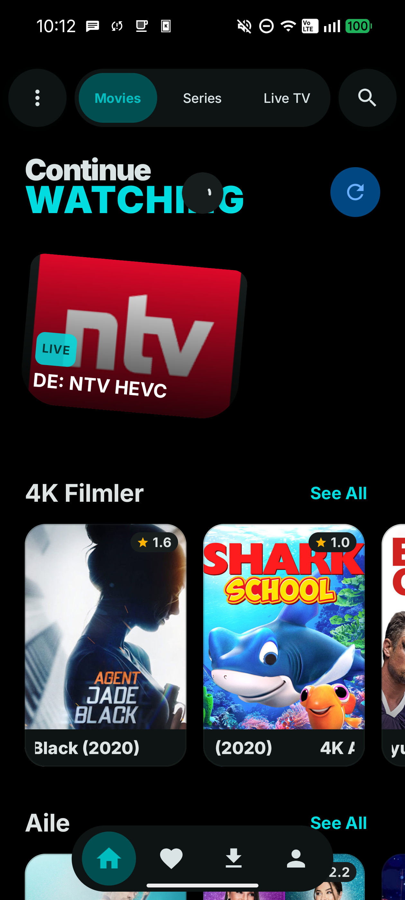
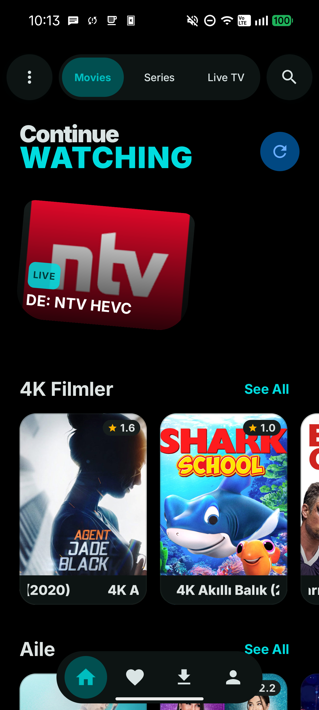
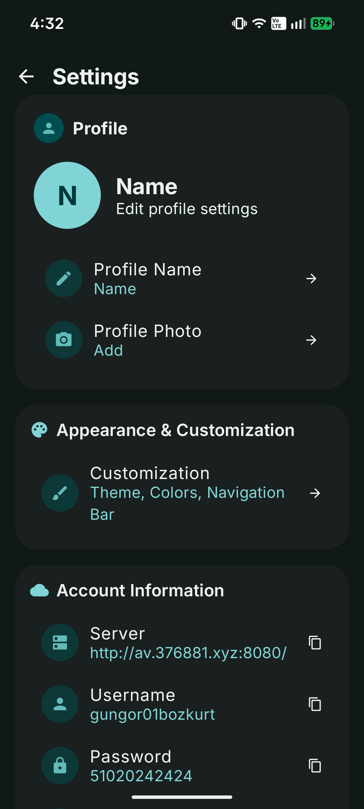

# 📺 MaterialTV


**MaterialTV** is a next-generation, high-performance IPTV & VOD player for Android mobile devices and Android TV, built with **Kotlin**, **Jetpack Compose**, and **Material 3 Expressive UI Design System**.

---

## 📸 Screenshots

| 🏠 Home & Continue Watching | 👤 Profile & Analytics | ⚙️ Settings & Customization |
| :---: | :---: | :---: |
|  |  |  |

---

## ✨ Features

- ⚡ **Expressive Hero Carousel & Bento Layout**: Smooth, non-glitchy Continue Watching carousel with long-press quick actions (Pin/Unpin, Favorite toggle, Remove).
- 🎬 **Dual Player Engine**: Seamless playback powered by **ExoPlayer (Media3)** for HLS/DASH/RTSP streams with **LibVLC** fallback support.
- 📡 **Xtream Codes & M3U Playlist Support**: Automatic catalog synchronization, category filtering, and EPG (Electronic Program Guide) scheduling.
- 💬 **OpenSubtitles & Subtitle Customization**: Integrated OpenSubtitles REST API for real-time subtitle search, downloading, font scaling, and color customization.
- 🍿 **TMDB Metadata Enrichment**: Rich media metadata including posters, backdrops, cast & crew, ratings, and genre tags.
- 💖 **Reactive Favorites & Watch History**: Instant favorite state synchronization and detailed watch history tracking with resume playback progress.
- 🌍 **Full Multi-Language Support (11 Languages)**: English, Turkish (Türkçe), German (Deutsch), Spanish (Español), French (Français), Russian (Русский), Japanese (日本語), Arabic (العربية), Portuguese (Português), Urdu (اردو), and Chinese (中文).
- 🛡️ **Security & Offline Storage**: Secure SQLCipher encrypted SQLite database and 512MB Coil disk/RAM image caching for instant poster loads.

---

## 🛠️ Architecture & Tech Stack

- **Architecture**: MVVM (Model-View-ViewModel) + Clean Architecture + Repository Pattern
- **UI Framework**: Jetpack Compose, Material 3 Adaptive Navigation Suite, Lottie Animations
- **Dependency Injection**: Google Hilt
- **Asynchronous / State**: Kotlin Coroutines & StateFlow / SharedFlow
- **Network**: Retrofit 2, OkHttp 4, Kotlinx Serialization, JSoup
- **Local Database**: Room DB (with Paging 3 integration)
- **Image Loading**: Coil (SVG, GIF, Disk/Memory Caching)
- **Background Tasks**: WorkManager & Hilt Work

---

## 🚀 Building & Installation

### Prerequisites
- Android Studio Ladybug or newer
- JDK 11+
- Android SDK 35 (Target) / Min SDK 24 (Android 7.0+)

### Building Signed Release APK
To compile and generate a signed release APK with code shrinking (R8) enabled:

```bash
# Clean and assemble signed release APK
./gradlew clean assembleRelease --no-daemon
```

---

## 📄 License

This project is licensed under the MIT License - see the [LICENSE](LICENSE) file for details.

*Designed with ❤️ by [Hasan Ege](https://github.com/hasan-ege)*
