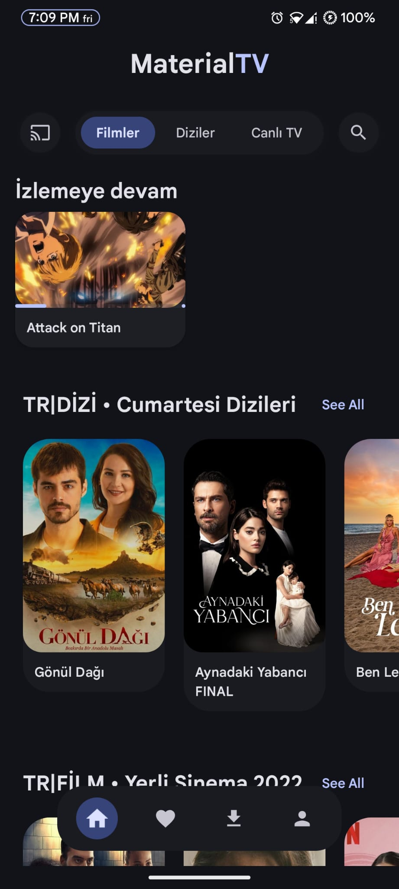
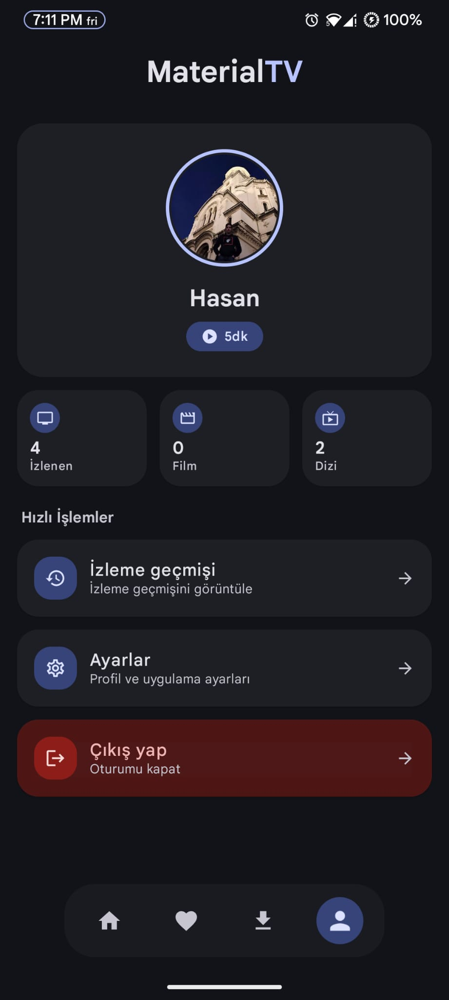
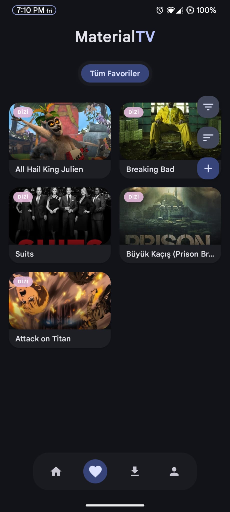
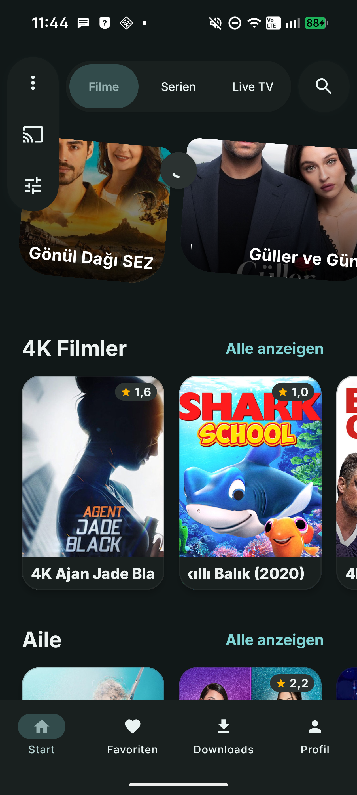
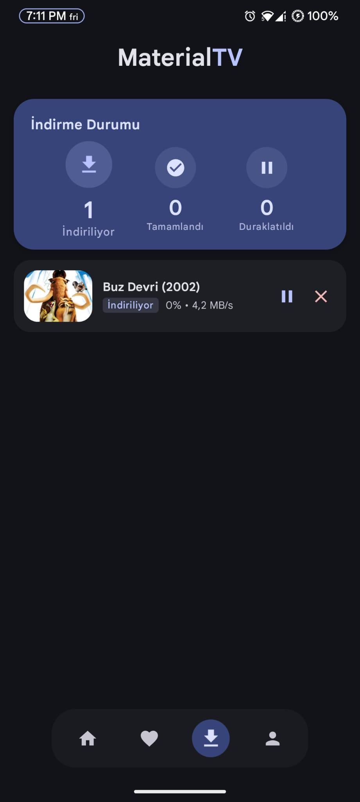
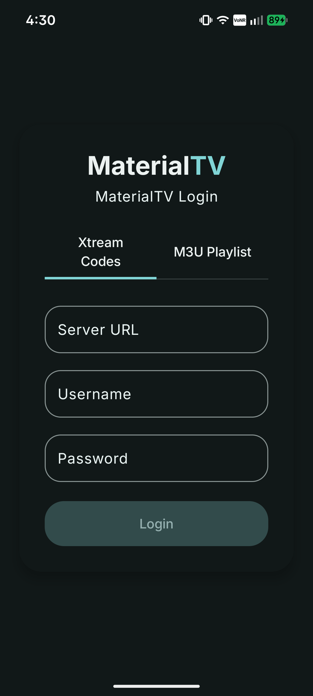
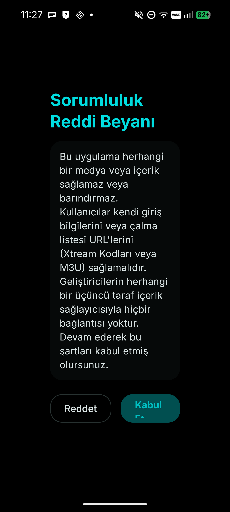

<div align="center">

# 📺 MaterialTV

### A Modern IPTV & VOD Player for Android

[](https://github.com/hasan-ege/MaterialTV/releases/latest)
[](https://github.com/hasan-ege/MaterialTV)
[](https://kotlinlang.org)
[](https://developer.android.com/jetpack/compose)
[](https://m3.material.io/)
[](LICENSE)
[](https://github.com/hasan-ege/MaterialTV/stargazers)

**MaterialTV** is a next-generation, high-performance IPTV & VOD player for Android, built from the ground up with **Kotlin**, **Jetpack Compose**, and **Material 3 Expressive** design language. Experience your IPTV content like never before — with beautiful animations, triple-engine playback, and smart media enrichment.

---

### 📥 Download
<a href="https://github.com/hasan-ege/MaterialTV/releases/latest">
  
</a>
&nbsp;&nbsp;
<a href="obtainium://add/https://github.com/hasan-ege/MaterialTV">
  
</a>
> 💡 **Tip:** Clicking the **Obtainium** badge will open the app and automatically add MaterialTV for seamless updates.

</div>

---

## 📸 Screenshots

<div align="center">

| 🏠 Home & Continue Watching | 👤 Profile & Analytics | ⚙️ Settings & Customization |
| :---: | :---: | :---: |
|  |  |  |

| ⭐ Favorites | 📂 Categories | ⬇️ Downloads |
| :---: | :---: | :---: |
|  |  |  |

| 🔐 Login | 💬 Subtitles |
| :---: | :---: |
|  |  |

</div>

---

## ✨ Key Features

<table>
<tr>
<td width="50%">

### 🎬 Triple Player Engine
Seamless playback with **ExoPlayer (Media3)**, **LibVLC**, and **LibMPV (FFmpeg)** — switch engines on-the-fly for maximum codec compatibility.

### 📡 Xtream Codes & M3U Support
Full Xtream Codes API integration with automatic catalog sync, category filtering, and EPG (Electronic Program Guide) scheduling.

### 🍿 TMDB Metadata Enrichment
Rich media info including posters, backdrops, cast & crew, ratings, and genre tags — all fetched and cached automatically.

### 💬 OpenSubtitles & SkipDB
Real-time subtitle search & download via OpenSubtitles API. Auto skip intros/outros with SkipDB integration.

</td>
<td width="50%">

### ⚡ Expressive UI & Animations
Material 3 Expressive hero carousel, spring animations, haptic feedback, and premium bento layouts.

### 💖 Smart Favorites & Watch History
Reactive favorite sync, detailed watch history with resume progress, and continue watching carousel with quick actions.

### 🌍 11 Languages Supported
English, Türkçe, Deutsch, Español, Français, Русский, 日本語, العربية, Português, اردو, 中文

### 🛡️ Secure & Offline-Ready
SQLCipher encrypted local database, 512MB Coil image cache, and download manager for offline viewing.

</td>
</tr>
</table>

---

## 🏗️ Architecture & Tech Stack

```
┌─────────────────────────────────────────────────────────┐
│                    UI Layer (Compose)                    │
│  Activities • Fragments • ViewModels • Navigation       │
├─────────────────────────────────────────────────────────┤
│                   Domain Layer                          │
│  Use Cases • Business Logic • Models                    │
├─────────────────────────────────────────────────────────┤
│                    Data Layer                           │
│  Repositories • API Services • Room DB • Cache          │
├─────────────────────────────────────────────────────────┤
│                  Infrastructure                         │
│  Hilt DI • WorkManager • Coroutines & Flow              │
└─────────────────────────────────────────────────────────┘
```

| Category | Technology |
|---|---|
| **Architecture** | MVVM + Clean Architecture + Repository Pattern |
| **UI Framework** | Jetpack Compose, Material 3 Adaptive Navigation, Lottie |
| **Dependency Injection** | Hilt (Google Dagger) |
| **Async / State** | Kotlin Coroutines, StateFlow, SharedFlow |
| **Networking** | Retrofit 2, OkHttp 4, Kotlinx Serialization, JSoup |
| **Local Storage** | Room DB + SQLCipher + Paging 3 |
| **Image Loading** | Coil (SVG, GIF, Disk/Memory Cache) |
| **Video Playback** | ExoPlayer (Media3), LibVLC, LibMPV (FFmpeg) |
| **Background Tasks** | WorkManager + Hilt Worker |
| **Metadata** | TMDB API, OpenSubtitles API, SkipDB |

---

## 🚀 Building & Installation

### Prerequisites
- Android Studio Ladybug or newer
- JDK 17+
- Android SDK 36 (Compile) / SDK 35 (Target) / Min SDK 26 (Android 8.0+)

### Build Debug APK
```bash
./gradlew assembleDebug
```

### Install on Connected Device
```bash
./gradlew installDebug
```

### Build Signed Release APK
```bash
./gradlew clean assembleRelease --no-daemon
```

> [!NOTE]
> Release builds have R8 code shrinking enabled and produce ABI-split APKs for `arm64-v8a`, `armeabi-v7a`, `x86`, and `x86_64`.

---

## 🤝 Contributing

Contributions, issues, and feature requests are welcome! Feel free to check the [issues page](https://github.com/hasan-ege/MaterialTV/issues).

1. **Fork** the project
2. **Create** your feature branch (`git checkout -b feature/amazing-feature`)
3. **Commit** your changes (`git commit -m 'feat: add amazing feature'`)
4. **Push** to the branch (`git push origin feature/amazing-feature`)
5. **Open** a Pull Request

---

## ⭐ Star History

<div align="center">

[](https://star-history.com/#hasan-ege/MaterialTV&Date)

</div>

---

## ⚠️ Disclaimer

> [!WARNING]
> **MaterialTV** does **not** provide, host, or distribute any IPTV content. It is a media player application that connects to user-provided Xtream Codes API or M3U playlist URLs. Users are solely responsible for ensuring their use of third-party IPTV services complies with all applicable laws and regulations. The developer assumes no liability for misuse.

---

## 📄 License

This project is licensed under the **MIT License** — see the [LICENSE](LICENSE) file for details.

---

<div align="center">

**Crafted with ❤️ by [Hasan Ege](https://github.com/hasan-ege)**


</div>
